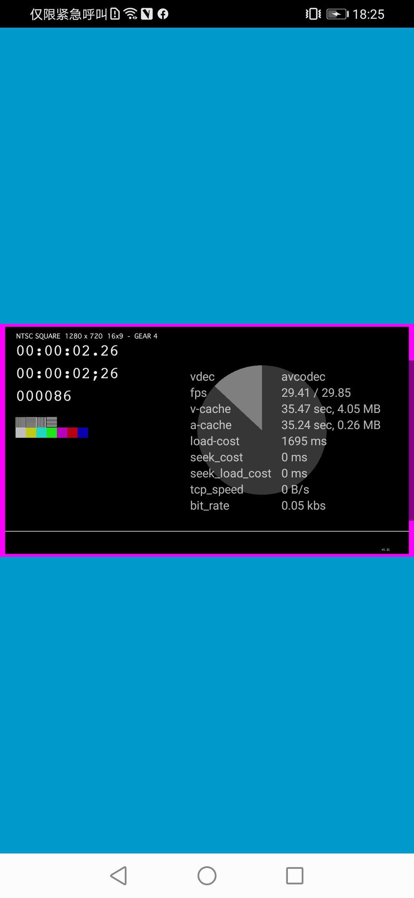

# ijkplayer_Build4Android
ijkplayer k0.8.8 base on FFmpeg 4.0

**播放效果截图**



# 一、源码库和 Tags
[Ijkplayer](https://github.com/bilibili/ijkplayer) 源码：https://github.com/bilibili/ijkplayer

[Ijkplayer Tags](https://github.com/bilibili/ijkplayer/tags) 列表：https://github.com/bilibili/ijkplayer/tags

[BiliBili OpenSSL  Tags](https://github.com/bilibili/openssl/tags) 列表：https://github.com/bilibili/openssl/tags

[BiliBili FFmpeg Tags](https://github.com/bilibili/FFmpeg/tags) 列表：https://github.com/bilibili/FFmpeg/tags

# 二、编译环境
- 系统：MacOS Monterey 12.5.1，Apple M1
- NDK: **android-ndk-r10e**

配置好环境变量，**ANDROID_SDK** 和 **ANDROID_NDK**，我用的 zsh
```bash
vim ~/.zshrc
source ~/.zshrc
```

# 三、配置和编译
## 1、下载 ijkplayer 源码
直接从 https://github.com/bilibili/ijkplayer/releases/tag/k0.8.8 下载最新版本 k0.8.8 代码，或用以下 git 命令拉取
```bash
git clone https://github.com/Bilibili/ijkplayer.git ijkplayer
cd ijkplayer
git checkout -B latest k0.8.8
```

## 2、修改编译配置
### 1）修改需要编译的 ABI 架构
我只需编译 armv7a 和 arm64，修改以下脚本，避免拷贝和编译多份不同架构的代码。

把以下这些脚本里的 **pull_fork** 只保留需要的架构。

**init-android-openssl.sh**
   
**init-android.sh**
    
**init-android-libsoxr.sh** 

```bash
pull_fork "armv5"
pull_fork "armv7a"
pull_fork "arm64"
pull_fork "x86"
pull_fork "x86_64"

改成 =======>>>>

pull_fork "armv7a"
pull_fork "arm64"
```

把以下这些脚本里的 **ACT_ABI_32** 和 **ACT_ABI_64** 只保留需要的架构。

**./android/contrib/compile-openssl.sh**
  
**./android/contrib/compile-libsoxr.sh**
  
**./android/compile-ijk.sh**

    
```bash
ACT_ABI_32="armv5 armv7a x86"
ACT_ABI_64="armv5 armv7a arm64 x86 x86_64"

改成 =======>>>>

ACT_ABI_32="armv7a"
ACT_ABI_64="armv7a arm64"
```
    
### 2）修改 ijkplayer 依赖的 FFmpeg 的版本（改成 4.0 版本）
  **ijkplayer k0.8.8 默认的 FFmpeg 的版本是 3.4**，即 ff3.4--ijk0.8.7--20180103--001，**现改成 FFmpeg 4.0 版本 ff4.0--ijk0.8.8--20210426--001**，最新版本列表见：https://github.com/bilibili/FFmpeg/tags
  
  在 init-android.sh 脚本中，改完后如下：

```bash
IJK_FFMPEG_UPSTREAM=https://github.com/Bilibili/FFmpeg.git
IJK_FFMPEG_FORK=https://github.com/Bilibili/FFmpeg.git
#IJK_FFMPEG_COMMIT=ff3.4--ijk0.8.7--20180103--001
IJK_FFMPEG_COMMIT=ff4.0--ijk0.8.8--20210426--001
IJK_FFMPEG_LOCAL_REPO=extra/ffmpeg

set -e
TOOLS=tools

git --version

echo "== pull ffmpeg base =="
sh $TOOLS/pull-repo-base.sh $IJK_FFMPEG_UPSTREAM $IJK_FFMPEG_LOCAL_REPO

function pull_fork()
{
    echo "== pull ffmpeg fork $1 =="
    sh $TOOLS/pull-repo-ref.sh $IJK_FFMPEG_FORK android/contrib/ffmpeg-$1 ${IJK_FFMPEG_LOCAL_REPO}
    cd android/contrib/ffmpeg-$1
    git checkout ${IJK_FFMPEG_COMMIT} -B ijkplayer
    cd -
}

#pull_fork "armv5"
pull_fork "armv7a"
pull_fork "arm64"
#pull_fork "x86"
#pull_fork "x86_64"

./init-config.sh
./init-android-libyuv.sh
./init-android-soundtouch.sh
```

## 3、修改编译的版本类型（精简版/完整版）
默认是精简版，完整版支持的格式更多，但是编译出的包体积更大，可根据自己的需要进行选择，本文编译的的精简版

```bash
cd config 
rm module.sh 
ln -s module-default.sh module.sh # 完整版 
ln -s module-lite.sh module.sh # 精简版 
ln -s module-lite-hevc.sh module.sh # 包含 HEVC 的精简版
```

## 4、初始化项目（下载依赖的代码）

```bash
# 下载指定的 ffmpeg 源码 ff4.0--ijk0.8.8--20210426--001
./init-android.sh

# 下载 openssl 源码，用于支持 https
./init-android-openssl.sh
```

## 5、开始编译

```bash
# 在项目根目录下
cd android/contrib 

# 编译 openssl
./compile-openssl.sh clean  
./compile-openssl.sh all  

# 编译 FFmpeg 
./compile-ffmpeg.sh clean 
./compile-ffmpeg.sh all  

# 编译 ijkplayer
cd ..  
./compile-ijk.sh all
```

## 6、编译过程遇到的错误
**注意：如期间遇到弹窗提示 ndk 的一些命令行工具不安全，不用管，选择【打开】或【取消】，在 Mac 的 【系统偏好设置】-->【安全性与隐私】的提示里选择【仍然允许】**
### 1）编译 openssl 出错，错误如下：
**error: undefined reference to 'OBJ_create'**

**error: ld returned 1 exit status**

```bash
../libcrypto.a(ec_pmeth.o):ec_pmeth.c:function pkey_ec_ctrl_str: error: undefined reference to 'OBJ_ln2nid'
../libcrypto.a(asn_moid.o):asn_moid.c:function oid_module_init: error: undefined reference to 'OBJ_create'
../libcrypto.a(asn_moid.o):asn_moid.c:function oid_module_init: error: undefined reference to 'OBJ_create'
collect2: error: ld returned 1 exit status
make[2]: *** [link_app.] Error 1
make[1]: *** [openssl] Error 2
make: *** [build_apps] Error 1
./compile-openssl.sh all
```

**失败原因：多线程编译导致**

**解决方案：改成单线程编译，[参考链接](https://github.com/bilibili/ijkplayer/issues/5113)：**

需要修改的脚本：**./android/contrib/tools/do-detect-env.sh   #91 行**的 

```bash
# 原本下面是通过系统命令 "sysctl -n machdep.cpu.thread_count" 来获取并设置编译线程数的，比如我电脑获取的是 8
export IJK_MAKE_FLAG=-j`sysctl -n machdep.cpu.thread_count`

改成 =======>>>>

# 强行改成单线程编译
export IJK_MAKE_FLAG=-j1
```
### 2）编译 ffmpeg 出错，错误如下：
**Unknown option "--disable-ffserver".**

```bash
--------------------
[*] check ffmpeg env
--------------------
OpenSSL detected

--------------------
[*] configurate ffmpeg
--------------------
/Users/wangjianjun/Alan/OpenSrcCode/ijkplayer_k0.8.25_ffmpeg4.0/ijkplayer-k0.8.8/android/contrib/build/ffmpeg-armv7a/toolchain/bin//arm-linux-androideabi-gcc
Unknown option "--disable-ffserver".
See ./configure --help for available options.
```
**出错原因：ffmpeg 4.0 删除了 ffserver**

**解决方案：注释掉 ffserver 配置，[参考链接](https://github.com/bilibili/ijkplayer/issues/4690)，修改 config/module.sh 文件，注释掉以下两行：**

```bash
export COMMON_FF_CFG_FLAGS="$COMMON_FF_CFG_FLAGS --disable-ffserver"
export COMMON_FF_CFG_FLAGS="$COMMON_FF_CFG_FLAGS --disable-vda"
```
### 3）编译 ffmpeg 出错，错误如下：
**error: undefined reference to 'ff_ac3_parse_header'**

**出错原因：ffmpeg 4.0 不再支持 eac3**

**解决方案：禁掉 eac3，[参考链接](https://blog.csdn.net/hhbgk/article/details/99191916)，修改 config/module.sh 文件，增加如下一行：**

```bash
# 在 export COMMON_FF_CFG_FLAGS="$COMMON_FF_CFG_FLAGS --enable-bsfs" 下方添加：
export COMMON_FF_CFG_FLAGS="$COMMON_FF_CFG_FLAGS --disable-bsf=eac3_core"
```

### 4）编译 ijkplayer 出错，错误如下：
**Android NDK: Host 'awk' tool is outdated. Please define NDK_HOST_AWK to point to Gawk or Nawk !**

**解决方案：[参考链接](https://stackoverflow.com/questions/8384213/android-ndk-revision-7-host-awk-tool-is-outdated-error)**

```bash
1、进入到目录： android-ndk-r10e/prebuilt/darwin-x86_64/bin
2、将 awk 重命名为 awk_
```

## 7、编译结果
**编译好的 so 放在了本项目的 ./build_output 中，基于 ijkplayer k0.8.8 ffmpeg 4.0(ff4.0--ijk0.8.8--20210426--001) 并包含 openssl、yuv、SDL**
### 1）编译 openssl


### 2）编译 ijkffmpeg

### 3）编译 ijkplayer
**armeabi-v7a:**

**arm64-v8a:**


